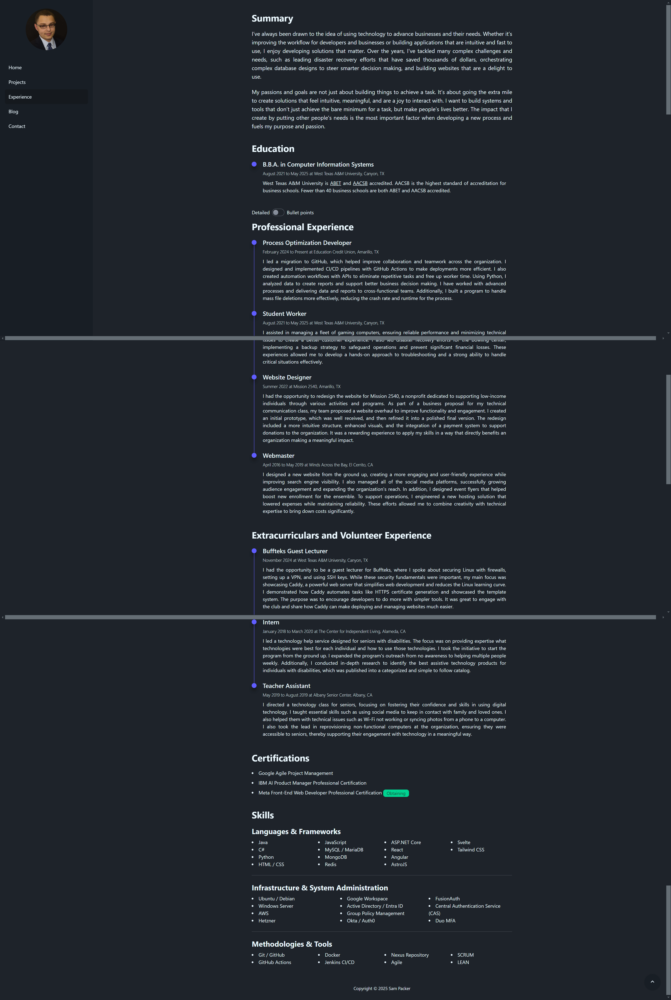

Redesigning a website can be challenging, especially when it's a cluttered page that you're familiar with. That’s
exactly how I felt when I first looked at my experience page. It was packed with information: summary, experience,
certifications, skills. All the essentials you’d expect on a résumé. But the problem wasn’t the content; it was how it
was presented. Everything was dumped on the page at once, with no visual hierarchy to guide the eye. It was just a wall
of text.

Sure, there was a timeline, some styling, and bigger titles with padding, but it still felt overwhelming. There was
nothing “big” to scan for, no clear focal points. It was a lot to take in, and I knew it had to change.

### The First Attempt: Adding a Toggle

My first revision was a step in the right direction, but it wasn’t enough. I added a toggle feature, letting users
switch between a detailed view and a bullet point view. The detailed view was task oriented, while the bullet point view
was tailored for recruiters: action words, measurable results, the standard stuff. It was a nice addition, but it didn’t
solve the core problem. The wall of text was still there, just slightly rearranged.

I realized I was treating the symptoms, not the root cause. The page needed a complete overhaul, not just a quick fix.

### The Solution: Collapsible Cards

After countless revisions and going back to the drawing board dozens of times, I finally landed on an idea that worked:
collapsible cards. Each card shows the title, location, and dates worked. When you click on it, it expands to reveal
more details. To make it visually distinct, I gave the expanded cards a different background shade and added a hover
animation to signal interactivity.

The result? A page that’s no longer a wall of text but a series of digestible, scannable cards. Now, when someone lands
on the page, they can quickly scan for what’s interesting instead of feeling overwhelmed.

### The Role of Analytics

Analytics have been my secret weapon throughout this process. For example, I noticed a lot of visitors were coming from
LinkedIn. I had a “Let’s connect!” button on my front page, but no one clicked it. Why? Because if someone’s (likely)
visiting my site from LinkedIn, they’re probably already connected to me. It was redundant, and analytics helped me see
that.

I also noticed people were more interested in my GitHub than my other social media links. But those links were tucked
away in the bottom left sidebar like an afterthought. So, I moved them front and center, adding icons for GitHub and
LinkedIn to make them easier to find.

Then there was the bounce rate. At first glance, it seemed low, but when I dug deeper, I realized people were scrolling
all the way down the homepage, clicking on the experience page, getting overwhelmed, and leaving. It was a wake-up call
that the experience page needed to be rethought. Analytics don’t just show you what’s working; they show you where
you’re losing people.

### The Pass / Fail Reality

Here’s the hard truth: your portfolio and résumé don’t get graded on a curve. They’re pass / fail. Either someone’s
impressed and wants to know more, or they’re not. There’s no “That's an 85%, here are some improvements.” In the real
world of recruiting, you either make the cut or you don’t.

That’s why every detail matters. From the way information is presented to the placement of buttons and links, everything
needs to be frictionless. If someone has to work too hard to find what they’re looking for, they’re not going to stick
around.

### Iterate, Iterate, Iterate

Redesigning my experience page taught me a lot about the importance of iteration. It’s not about getting it perfect on
the first try; it’s about being willing to experiment, learn from analytics, and make changes based on what you
discover.

So, if you’re staring at a cluttered page or a design that just isn’t working, don’t be afraid to tear it down and start
over. Sometimes, the best solutions come from rethinking the problem entirely. And if all else fails, just remember:
collapsible cards might be your new best friend.