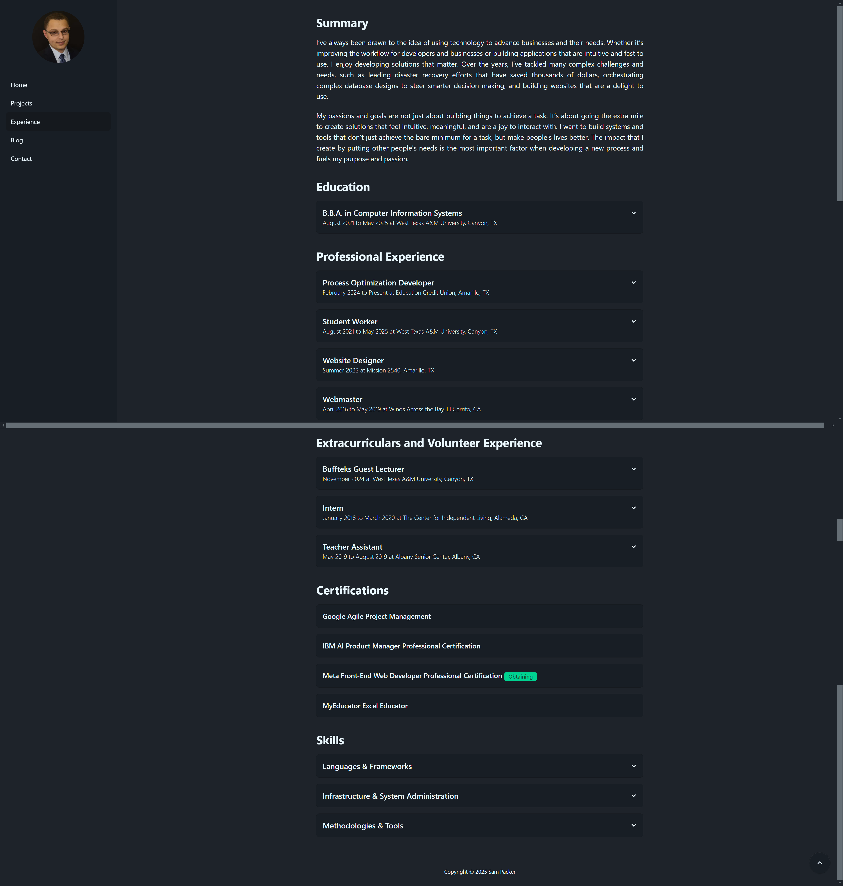

Redesigning a website can be challenging, especially when it's a cluttered page that you're familiar with. That’s
exactly how I felt when I first looked at my experience page. It was packed with information: summary, experience,
certifications, skills. It had everything you'd expect, but the problem wasn’t the content. The problem was how it was
presented. Everything was dumped on the page at once, with no visual hierarchy to guide the eye. It was just a wall of
text.

Sure, there was a cue that it was a timeline, some styling, and bigger titles with padding, but it still felt
overwhelming. There was nothing “big” to scan for, no clear focal points. It was a lot to take in, and I knew it had to
change.

### The First Attempt: Adding a Toggle

My first revision was adding a toggle feature, letting users switch between a detailed view and a bullet point view. It
was an attempt to give the user an option to reduce the clutter, but it wasn't enough. The detailed view was task
oriented and meant to tell more of a story. In contrast, the bullet point view was tailored for recruiters by using
action words and measurable results. It was a nice addition, but it didn’t solve the core problem. The wall of text was
still there, just slightly rearranged.

I realized I was treating the symptoms, not the root cause. The page needed a complete overhaul, not just a quick fix.

### The Solution: Collapsible Cards

After countless revisions and going back to the drawing board dozens of times, I finally landed on an idea that worked:
collapsible cards. Each card shows the title, location, and dates worked. When you click on it, it expands to reveal
more details. To make it visually distinct, I gave the expanded cards a different background shade and added a hover
animation to signal interactivity.

The end result ended up looking fantastic. It's no longer a wall of text but rather a scannable list of information.
Now, when someone lands on the page, they can quickly scan for what they find interesting. The bigger titles draw their
attention to the roles rather than the specific details. With a résumé, you do want your contributions to be front and
center for a recruiter. However, people expect different things with a website. They expect scannable and big components
rather than walls of text.

### The Role of Analytics

Analytics have been a valuable asset while I continually develop my portfolio. For example, I noticed a lot of visitors
were coming from LinkedIn. I had a “Let’s connect!” button on my front page, but no one clicked it. Why? Because if
someone’s (likely) visiting my site from LinkedIn, they’re probably already connected to me. It was redundant, and
analytics helped create a more effective home page.

People were actually more interested in my GitHub than my LinkedIn. However, the link to my GitHub was in the bottom
left of the page. I didn't want it to be hidden with the new information, so I moved both links to the front page.

The metric for the experience page that I was interested in was the bounce rate. At first glance, the bounce rate seemed
low. I dug deeper and realized people were scrolling all the way down the home page, clicking on the experience page,
getting overwhelmed, and leaving. It was deceiving data and to the untrained eye, it could've made it seem like people
were liking the page when they actually weren't. Since I made these revisions in March, the outcome was successful!
People consistently visit my projects page after my experience page when they didn't previously. On average, there have
been more pageviews since the redesign, and the drop-off after the experience page is less.

### The Pass / Fail Reality

Here’s the harsh truth: your portfolio and résumé don’t get graded out of 100. They’re either a pass or fail. Either
someone’s impressed and wants to know more, or they’re not. There’s no “That's an 85%, here are some improvements.” In
the real world of recruiting, you either make the cut or you don’t.

That’s why every detail matters. From the way information is presented to the placement of buttons and links, everything
needs to be frictionless. If someone has to work too hard to find what they’re looking for, they’re not going to stick
around. The choice in software that I used to build this website was a day one factor. I chose the fastest software and
tools for building my portfolio. Not the ones with the most features, but the one that objectively was the fastest.

### Iterating is Important

Redesigning my experience page taught me a lot about the importance of iteration. It’s not about getting it perfect on
the first try; it’s about being willing to experiment, learn from analytics, and make changes based on what you
discover. A lot of people build out their portfolio, call it good enough, and don't touch it. I try to spend time every
day experimenting and making changes. Of course, there have been a lot of experiments that never materialized, but how
can you know if you don't try? The job market is more competitive than ever, and you need to have the fastest, error
free, and accessible design to even get a chance to be looked at.